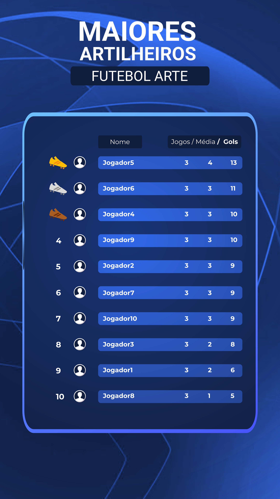

# Projeto gerador de jogadores artilheiro

Este projeto é uma ferramenta para contar o número de gols que cada jogador fez em jogos de futebol que acontecem todos os sábados. A partir de listas de presença, o projeto gera um arquivo JSON com as estatísticas dos jogadores e depois gera uma imagem com o `modelo.png` colocando os 10 primeiros jogadores da lista do JSON.

## Estrutura do Projeto

- `listas/`: Pasta onde os arquivos `.txt` com as listas de presença são armazenados.
- `players.json`: Arquivo JSON gerado com as estatísticas dos jogadores.
- `modelo.png`: Arquivo png modelo para ser preenchido pelo nome dos jogadores e estatísticas.
- `/`: Código-fonte do projeto, incluindo o script de contagem de gols.

## Como Usar

1. **Preparar as Listas:**
   - O nome da lista será salvo no projeto. Se você enviar uma lista com o mesmo nome, ela substituirá a lista antiga. Para salvar listas em sequência de dias, envie arquivos com nomes distintos para cada dia.

2. **Executar o Script:**
   - Certifique-se de ter o Node.js instalado.
   - Apague os arquivos `.txt` de exemplo da pasta `listas/`.
   - Navegue até o diretório do projeto e execute o script para criar as rotas e gerar o resultado:
     ```bash
     npm start
     ```
   - Envie a lista usando o comando `curl`:
     ```bash
     curl --request POST \
       --url http://localhost:3000/upload \
       --header 'Content-Type: multipart/form-data' \
       --form 'lista=lista1.txt'
     ```
   - Para pegar a imagem gerada, use o comando `curl`:
     ```bash
     curl --request GET \
       --url http://localhost:3000/image \
       --output imagem-gerada.png
     ```

3. **Visualizar os Resultados:**
   - O arquivo `players.json` contém a estatística dos jogadores, incluindo o número de gols por jogo.

## Exemplo de Resultado

Aqui está um exemplo de como o resultado final pode parecer:



## Requisitos

- Node.js
- Dependências especificadas no `package.json`